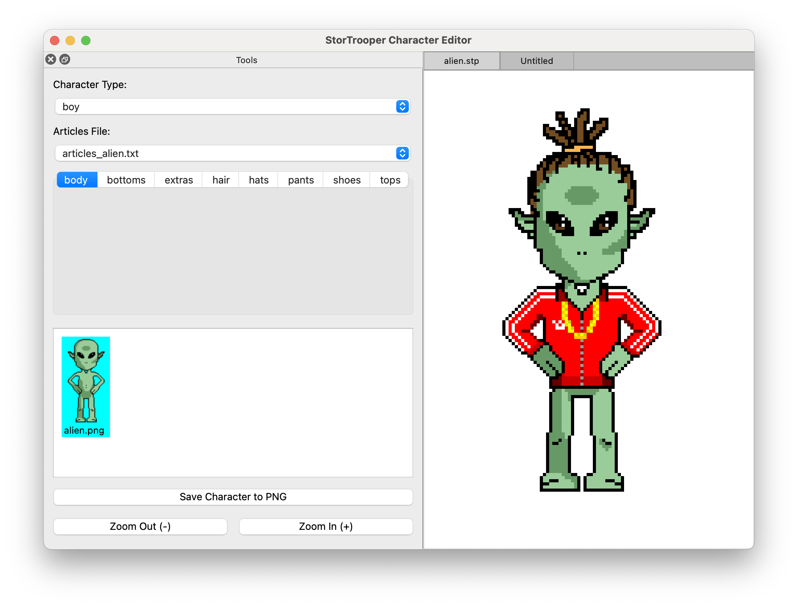

# Stortrooper Editor

Stortrooper Editor is a pixel art character creator tool. It allows users to compose characters by selecting different body parts (such as body, head, hair, and accessories) from a set of available assets.

## Features

- **Character Composition:** visually combine different parts to create unique characters.
- **Asset Selection:** choose from various styles (boy, girl, fashion, goth, etc.).
- **Live Preview:** see changes in real-time.
- **Export:** save your created characters as PNG images.

## Screenshot



## Getting Started

### Prerequisites

- Python 3
- Make (optional, for using the Makefile)

### Installation & Running

The easiest way to run the editor is using the provided `Makefile`.

1.  **Set up the environment and run:**

    ```bash
    make run
    ```

    This command will automatically create a virtual environment, install the required dependencies (from `requirements.txt`), and launch the application.

2.  **Clean up:**

    To remove the virtual environment and temporary files:

    ```bash
    make clean
    ```

### Manual Setup

If you prefer to run it manually without `make`:

1.  Create a virtual environment:

    ```bash
    python3 -m venv venv
    ```

2.  Activate the virtual environment:

    - On macOS/Linux: `source venv/bin/activate`
    - On Windows: `venv\Scripts\activate`

3.  Install dependencies:

    ```bash
    pip install -r requirements.txt
    ```

4.  Run the application:
    ```bash
    PYTHONPATH=src python3 -m stortrooper_editor.main
    ```
